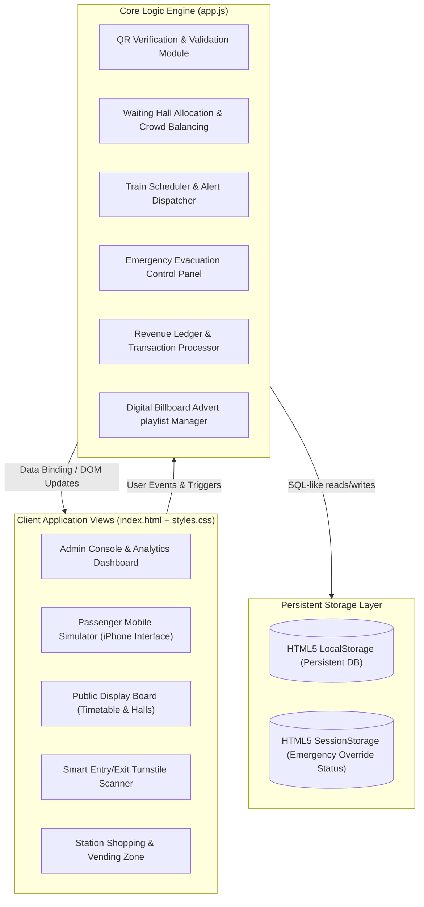
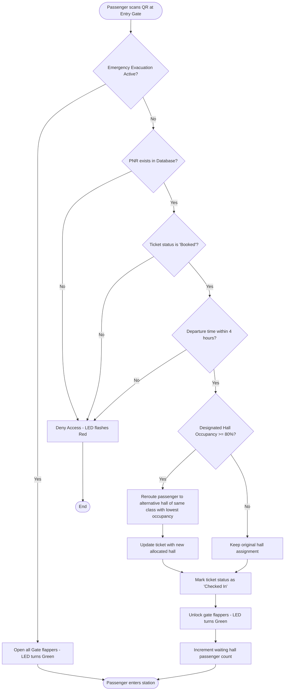

# SmartRail Hub – Technical Architecture & System Design Documentation
*Intelligent Passenger Management & Revenue Generation System for Indian Railways*

SmartRail Hub is an integrated station console and passenger portal designed to transform traditional railway stations into smart passenger hubs. It automates ticket verification, waiting hall allocations, and crowd control while offering revenue streams from smart vending machines, digital advertisements, and retail shops.

---

## 1. System Architecture

The SmartRail Hub uses a client-side single-page application (SPA) architecture designed for reliability, fast updates (HMR), and off-grid resilience.



### Architectural Component Details
1. **Client Views**: Single-Page App tabs toggle display blocks. Real-time updates occur via DOM bindings.
2. **Logic Engine**: Consists of sub-systems running in a unified runtime (`app.js` module). Features are fully decoupled using helper functions.
3. **Data Storage**: LocalStorage acts as the persistent relational database, ensuring station data remains saved across tab reloads and browser closures.

---

## 2. Use Case Diagram

The use case diagram illustrates the interactions between station actors (passengers, admins, smart gates, public display boards) and the core platform features.

```mermaid
leftToRightDirection
actor Passenger
actor Admin
actor "Smart Gate turnstile" as Gate
actor "Station Display Board" as Displays

rectangle "SmartRail Hub System" {
    usecase "Book Ticket & Auto-Allocate Hall" as UC1
    usecase "Scan QR Ticket for Entry/Exit" as UC2
    usecase "Dynamic Crowd Balancing" as UC3
    usecase "Track Live Train & Get Delay alerts" as UC4
    usecase "Buy Snacks/Items (Revenue Generation)" as UC5
    usecase "Configure Ads & Monitor Impressions" as UC6
    usecase "Trigger Emergency Evacuation Siren" as UC7
    usecase "View Arrivals & Lounge Occupancy" as UC8
}

Passenger --> UC2
Passenger --> UC4
Passenger --> UC5

Admin --> UC1
Admin --> UC4
Admin --> UC6
Admin --> UC7

Gate --> UC2
Gate --> UC3
Gate --> UC7

Displays --> UC6
Displays --> UC8
```

---

## 3. Passenger Flowchart (Check-In & Gate Access)

This flowchart represents the automated validation logic executed when a passenger scans their mobile or printed QR code at an entry turnstile.



---

## 4. Database Schema

The database model leverages JSON tables serialized and synced with browser storage. 

### 4.1. Waiting Halls Table (`halls`)
Represents the available lounges where passengers wait before boarding.
| Column | Type | Description | Sample Data |
| :--- | :--- | :--- | :--- |
| `id` | String (PK) | Unique identifier for the hall | `"hall-1"` |
| `name` | String | Commercial name of the lounge | `"Premium Executive Lounge (A)"` |
| `class` | String | Ticket tier eligibility (`Executive`, `Sleeper`, `General`) | `"Executive"` |
| `capacity` | Integer | Maximum occupancy limit | `60` |
| `occupancy` | Integer | Real-time passenger count | `12` |
| `comfort_index`| Float | Calculated ratio of occupancy (`occupancy / capacity`) | `0.20` |
| `platform_near`| String | Closest physical platform code | `"PF-1"` |

### 4.2. Train Schedules Table (`trains`)
Station timetable representing train arrivals, platforms, and schedules.
| Column | Type | Description | Sample Data |
| :--- | :--- | :--- | :--- |
| `train_no` | String (PK) | 5-digit Indian Railways train number | `"12626"` |
| `name` | String | Name of the train | `"Kerala Express"` |
| `source` | String | Source station code | `"NDLS"` |
| `destination` | String | Destination station code | `"TVC"` |
| `platform` | String | Departure platform assignment | `"PF-2"` |
| `departure_time`| String | Scheduled departure time (`HH:MM`) | `"14:40"` |
| `status` | String | Schedule status (`On Time`, `Delayed`, `Departed`) | `"On Time"` |
| `delay_mins` | Integer | Active delay duration in minutes | `0` |

### 4.3. Passenger Tickets Table (`tickets`)
Represents booked online (mobile) and offline (kiosk printed) boarding credentials.
| Column | Type | Description | Sample Data |
| :--- | :--- | :--- | :--- |
| `pnr` | String (PK) | 10-digit Passenger Name Record number | `"PNR-4829103"` |
| `passenger_name`| String | Full name of the traveler | `"Rajesh Kumar"` |
| `train_no` | String (FK) | References `trains.train_no` | `"12626"` |
| `ticket_class` | String | Ticket tier (`Executive`, `Sleeper`, `General`) | `"Executive"` |
| `coach` | String | Coach code | `"H1"` |
| `seat` | Integer | Assigned seat number | `12` |
| `allocated_hall_id`| String (FK) | References `halls.id` | `"hall-1"` |
| `status` | String | Check-in status (`Booked`, `Checked In`, `Boarded`, `Checked Out`) | `"Checked In"` |
| `ticket_type` | String | Delivery format (`Mobile`, `Printed`) | `"Mobile"` |
| `qr_data` | String | Payload encoded in the barcode | `"{'pnr':'PNR-4829103','class':'Executive','hall':'hall-1'}"` |

### 4.4. Revenue Transactions Table (`transactions`)
Detailed audit ledger for all station revenue streams.
| Column | Type | Description | Sample Data |
| :--- | :--- | :--- | :--- |
| `id` | String (PK) | Unique transaction identifier | `"tx-103"` |
| `type` | String | Revenue category (`Advertisement`, `Shop Rent`, `Vending Machine`)| `"Vending Machine"` |
| `source_name` | String | Revenue source description | `"Snack Machine PF-1 (Sale)"` |
| `amount` | Decimal | Monetary value in Rupees | `80.00` |
| `timestamp` | DateTime | Timestamp of transaction | `"2026-06-10T13:15:00Z"` |

### 4.5. Advertising Campaigns Table (`ads`)
Registry of campaigns displayed on digital displays.
| Column | Type | Description | Sample Data |
| :--- | :--- | :--- | :--- |
| `id` | String (PK) | Unique ad identifier | `"ad-1"` |
| `campaign_name`| String | Name of the campaign | `"Coca-Cola Summer Chill"` |
| `advertiser` | String | Sponsoring company name | `"Coca-Cola India"` |
| `target_demographic`| String | Audience target tier (`All`, `Premium`, `General`) | `"All"` |
| `description` | String | Marketing text displayed | `"Refresh your journey with ice-cold Coca-Cola!"`|
| `revenue_per_impression`| Decimal | Earned revenue per impression | `1.50` |
| `impressions` | Integer | Total counts displayed | `840` |
| `status` | String | Campaign operational state (`Active`, `Paused`) | `"Active"` |

### 4.6. Retail Shops Table (`shops`)
Commercial outlets inside the station.
| Column | Type | Description | Sample Data |
| :--- | :--- | :--- | :--- |
| `id` | String (PK) | Unique shop identifier | `"shop-1"` |
| `name` | String | Store name | `"Chai Point"` |
| `category` | String | Shop category | `"Food & Beverage"` |
| `rent_monthly` | Integer | Fixed monthly base rent | `25000` |
| `commission_rate`| Float | Percentage commission on gross sales | `0.08` |
| `sales_today` | Decimal | Today's accumulated sales | `4200.00` |

---

## 5. UI/UX Design & Screen Breakdown

The system is split into five distinct functional layouts accessible via the top navigation panel:

### 5.1. Admin Console & Dashboard Screen
Provides station masters with real-time operations control and analytics.
* **Top Metric Badges**: Live passenger count inside the station, count of delayed trains, active platform count, and overall accumulated station revenue (sum of ad impressions, kiosk sales, and store commissions).
* **Waiting Halls Grid**: Renders real-time visual progress bars showing occupancy status (green for comfortable, orange for moderate, red for full/balancing active).
* **AI Forecast Chart**: High-fidelity line graph forecasting passenger crowd flows over a 24-hour cycle.
* **Schedule Timetable**: Grid displaying all train schedules with delay modify buttons that trigger delay popups.
* **Ad Registry & Logs Feed**: Scrollable panels showing campaign impressions and an automated console logging system event entries.

### 5.2. Passenger Mobile App (IRCTC Portal Simulator)
Simulates the passenger's mobile interface embedded in an iPhone frame.
* **Digital Boarding Pass**: Shows PNR, Coach, Seat, and the dynamic QR code rendered on HTML Canvas.
* **Allocated Hall Route Navigator**: Interactive map coordinates locator showing pathfinding direction markers based on the passenger's allocated waiting hall location.
* **Live Notifications**: Pop-ups alerting passengers of train delays, boarding announcements, or emergency evacuation protocols.

### 5.3. Smart Gates turnstile Controller
Physical turnstile gate simulation model.
* **Scanning Deck**: Dropdown select simulating mobile scan reads.
* **Flapper Barriers**: Mechanical flappers styled in CSS with 3D rotations, opening/closing based on check-in scan results.
* **LED Status Indicator**: Emits red glow by default, transitions to a pulsing green glow upon approval, and flashes red upon rejection.

### 5.4. Public Station Bulletin Display
High-contrast terminal screen optimized for station display panels.
* **Railway Departure Board**: Large arrivals/departures schedule board.
* **Lounges Status Display**: Occupancy warnings notifying passengers about crowded waiting lounges.
* **Ad Rotator Display**: Displays current marketing campaigns, generating ad impression counts and revenue.

### 5.5. Shopping & Vending Zone Kiosk
Simulates station retail commerce.
* **Vending Rack**: Product catalog where clicking an item executes a direct sale simulation (Water, Chips, Chai, Sandwiches).
* **Retail Food Court**: Outlets representing Food court brands where users order meals, automatically calculating the station's commission-based revenue.

---

## 6. Project Modules

The SmartRail Hub codebase is modularly structured into six engine layers:

1. **Ticketing Module (`bookNewTicket`)**:
   - Generates random PNR records.
   - Allocates the nearest waiting lounge based on scheduled departure platform.
2. **Access Control Module (`triggerScan`, `animateGateState`)**:
   - Performs check-in/check-out validation.
   - Prevents double entries and scans outside the 4-hour departure window.
   - Directs flapper mechanics and LED signals.
3. **Crowd Management Module (`balanceCrowdOnCheckIn`)**:
   - Checks lounge occupancy thresholds.
   - Reroutes passengers to comfort zones of the same class if the primary hall reaches **80% occupancy**.
4. **Train Tracking Module (`updateTrainDelay`, `checkTrainAlerts`)**:
   - Calculates updated arrival times.
   - Distributes notifications to passenger apps.
   - Fires countdown warnings **10–20 minutes** before departures.
5. **Evacuation & Security Module (`triggerEmergencyEvacuation`)**:
   - Controls overriding gate opens.
   - Dispatches flash warnings to public display boards.
   - Automates gradual waiting lounge occupant evacuation counts towards zero.
6. **Revenue Ledger Module (`purchaseVendingSnack`, `purchaseShopFood`, `triggerAdImpression`)**:
   - Logs transactions on ads, vending sales, and store commissions.
   - Recalculates metrics and updates dashboard gauges.

---

## 7. Technology Stack

* **Front-end Tooling**: Vite 5.2 (HMR compiler bundler)
* **Core Logic**: Vanilla ES6+ Javascript (Decoupled modules running in browser VM)
* **CSS Framework**: Pure CSS3 (Flexbox/Grid layout, HSL color tokens, custom variables, cubic animations)
* **Persistence Database**: HTML5 LocalStorage (Key-value structure serialized via JSON parser)
* **Visual Graphics**: HTML5 Canvas 2D API (Vector drawing for forecasting graphs, analytics, and custom QR barcode patterns)

---

## 8. Operation Instructions

To launch the project, perform the following steps:
1. Install Node.js dependencies:
   ```bash
   npm install
   ```
2. Launch the Vite local dev server:
   ```bash
   npm run dev
   ```
3. Open the specified localhost link in your browser (`http://localhost:3005`).
